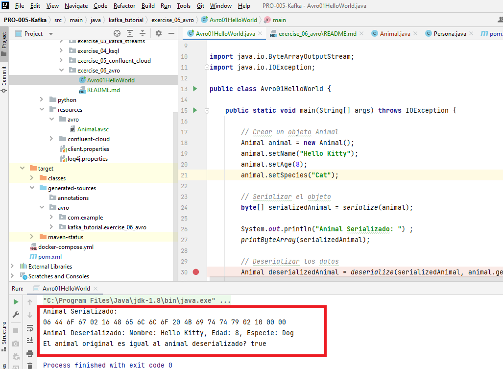

# AVRO

## Objectives

 1) Practice to use AVRO from scratch. With no other dependencies. Not even Kafka yet.

### Requirements

 * IntelliJ IDE
 * Maven and JDK installed in IntelliJ IDE

## Run

### Ejercicio 1
Ejecuta el programa y obtén un resultado parecido a este:

### Ejercicio 2
Modifica el programa y ejecútalo. ¿Has obtenido el mismo resultado? Y si es diferente,¿ 
en que es diferente?

### Ejercicio 3
Crea un fichero *.avsc nuevo. Básate en estos requerimientos.

Lista con el tipado de cada campo para el modelo Avro de Registro de Transacciones Bancarias:

ID de Transacción:
Tipo: long

Tipo de Transacción:
Tipo: string

Monto de la Transacción:
Tipo: double

Número de Cuenta Origen:
Tipo: string

Número de Cuenta Destino:
Tipo: string (puede ser nulo si la transacción no es una transferencia)

Fecha y Hora de la Transacción:
Tipo: string (siguiendo el formato ISO 8601, por ejemplo, "2023-01-25T15:30:00.000Z")

### Ejercicio 4
Del ejercicio anteriror, modifica el fichero .avsc, haciendo que un atributo obligue a que no sea nulo. 
Ejecuta el código y mira que error da.

Modfica el código para que todo vaya ok y acabe sin errores.

### Ejercicio 5
Mofica el fichero .avsc para que sea más complejo, añadiendo un enum, y una jerarquía con un atributo tipo hijo.